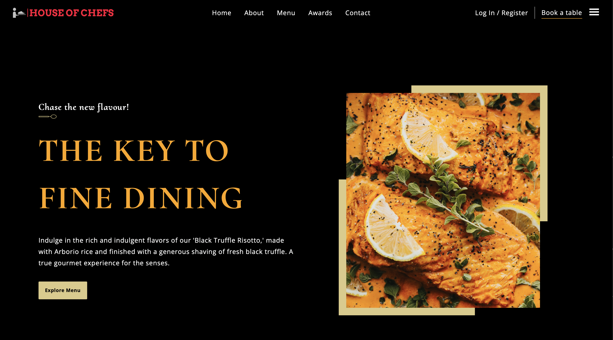

# House-of-Spices-Restaurant-Website

 <a href="https://house-of-spices-restaurant-website.vercel.app">Live Website</a>
 
## Implementation and Learnings

- React Functional components and their reusability
- React file and folder structure
- Fundamental CSS properties, mastering flex & grid
- Fundamentals of the CSS BEM Model
- From soft and pleasant animations to complex gradients
- Perfectly placed media queries for up to par responsiveness covering almost devices
- Finally, deployment of the website to the web servers.
 
# Getting Started with Create React App

This project was bootstrapped with [Create React App](https://github.com/facebook/create-react-app).

## Available Scripts

In the project directory, you can run:

### `npm start`

Runs the app in the development mode.\
Open [http://localhost:3000](http://localhost:3000) to view it in your browser.

The page will reload when you make changes.\
You may also see any lint errors in the console.

## Learn More

You can learn more in the [Create React App documentation](https://facebook.github.io/create-react-app/docs/getting-started).

To learn React, check out the [React documentation](https://reactjs.org/).

